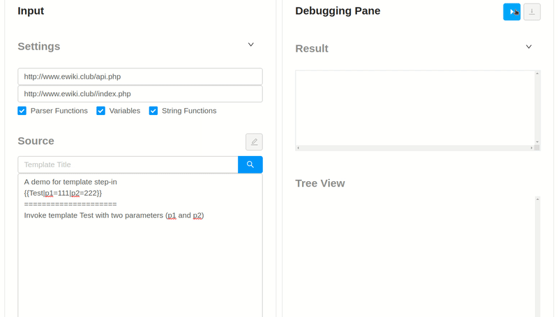

## Wikitext DevTools

Debugger and code optimizer designed for Wikitext.

Debugger Features:

- Code structure visualization with parse tree.
- Template step in/ step out. (Only supports templates in the same wiki for now.)
- Supports extension: Variables, ParserFunctions, StringFunctions.

  

[Demo Link](http://www.ewiki.club/index.php?title=Special:DebugTemplates)

Notes:

- The demo utilizes the free hosting service provided by Heroku. Heroku will shut down the server when it's idle, so the first request may take longer.
- The current version is not stable and under active development. The beta version will be released by the end of 2019. =)
